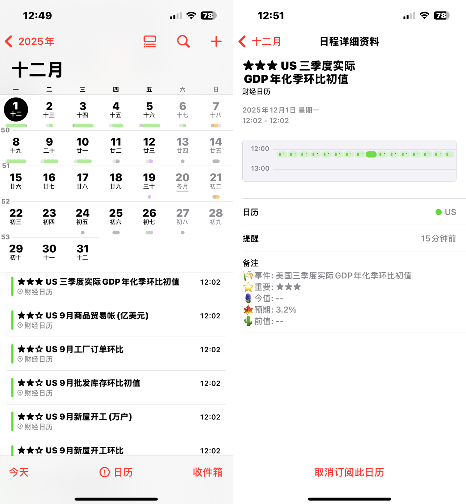

# 🗓️ 财经日历

#### 介绍
基于华尔街见闻数据的经济日历订阅服务，支持Outlook(不支持日程提醒), iCloud, Google Calendar 等日历应用。

## 主要功能

- 📅 提供重要经济事件（⭐️⭐️⭐️）
- ⏰ 数据发布前10分钟提醒
- ⌛ 15天内财经数据

## 支持的国家/地区

- **CN 中国**
- us 美国
- de 德国
- ea 欧元区
- gb 英国
- jp 脚盆鸡

## 订阅链接

- 中国：`https://raw.githubusercontent.com/obeya/economic_calendar/main/economic_cn.ics`
- 美国：`https://raw.githubusercontent.com/obeya/economic_calendar/main/economic_us.ics`
- 德国：`https://raw.githubusercontent.com/obeya/economic_calendar/main/economic_de.ics`

### ★★★
- 中国★★★：`https://raw.githubusercontent.com/obeya/economic_calendar/main/economic_cn_high_impact.ics`
- 美国★★★：`https://raw.githubusercontent.com/obeya/economic_calendar/main/economic_us_high_impact.ics`
- 德国★★★：`https://raw.githubusercontent.com/obeya/economic_calendar/main/economic_de_high_impact.ics`

## 如何订阅

### Apple 日历
1. 在 iPhone 上打开"设置"
2. 前往"日历" > "账户"
3. 选择"添加账户" > "添加订阅的日历"
4. 输入订阅链接

### Google 日历
1. 打开 Google Calendar
2. 点击左侧"其他日历"旁的 "+" 按钮
3. 选择"通过 URL 订阅"
4. 输入订阅链接（同上）
5. 点击"添加日历"

## 数据来源

数据来自[华尔街见闻](https://wallstreetcn.com/calendar)的经济日历。

